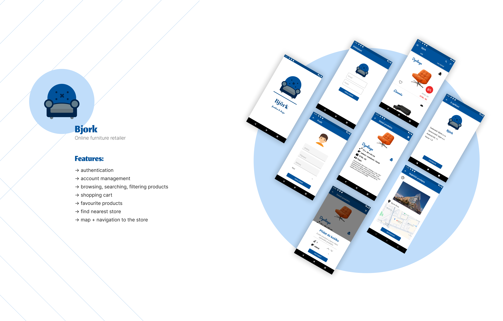

# Bjork

Native Android application for a fictional furniture retailer

## Description

The project was created to get familiar with tools for Android application development. The goal was to build a simple application for browsing and purchasing furniture, including authentication, integration with Google Maps, and the Firebase platform.

## Preview

## Tech Stack

- Java
- Android
  - XML Layouts
- Firebase
  - Firestore
  - Authentication
- Google Maps SDK
- Lottie
